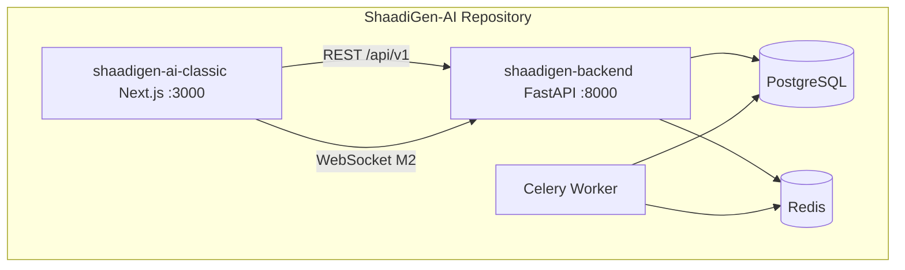
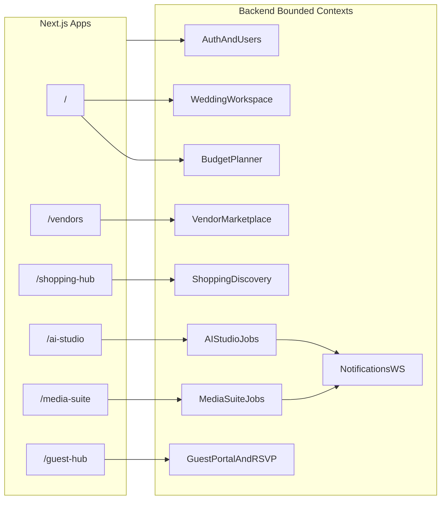
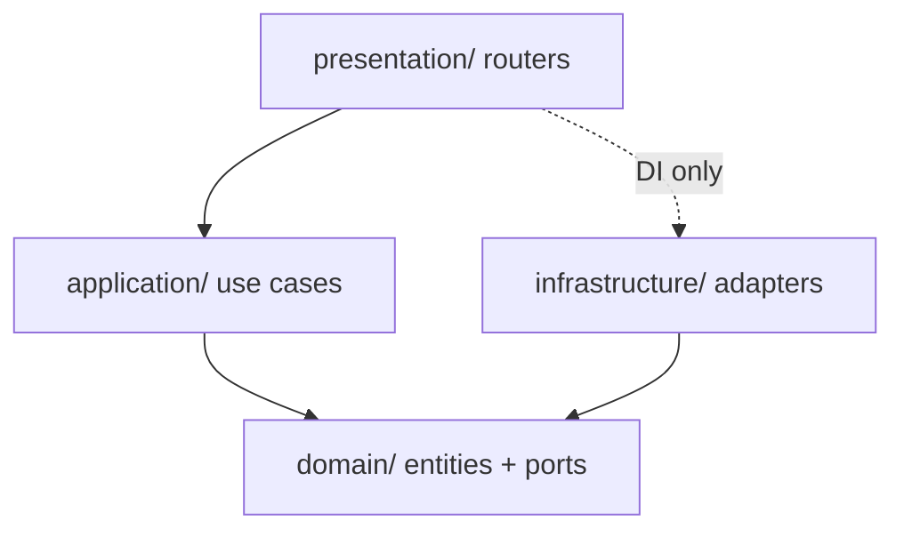
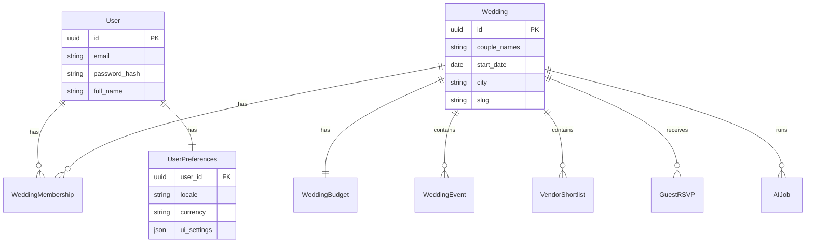
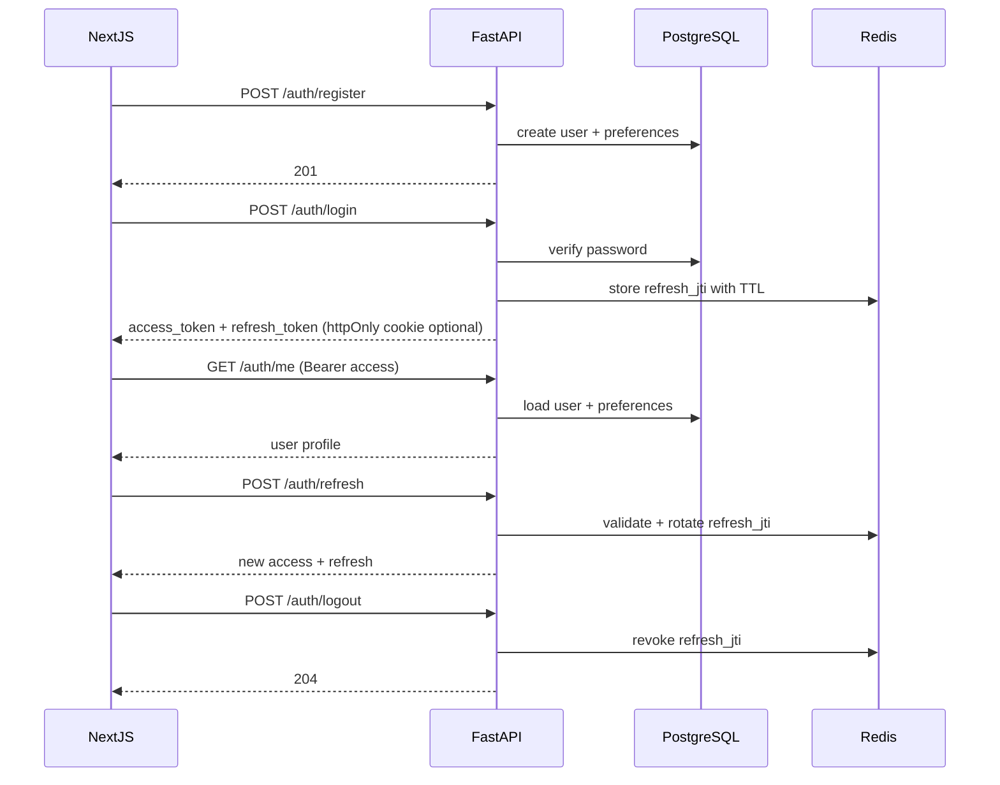

---
todos:
  - id: repo-init
    content: 'Create new GitHub repo; root README, .gitignore, Makefile, docker/compose.local.yml'
    status: pending
  - id: frontend-copy
    status: completed
    content: Copy shaadigen-ai-classic/ into new repo; wire NEXT_PUBLIC_API_URL to backend
  - id: m1-skeleton
    content: Create shaadigen-backend/ Clean Architecture skeleton + pyproject.toml (Python 3.12)
    status: pending
  - id: m1-compose
    content: 'Docker Compose postgres, redis, api, worker + Makefile targets'
    status: pending
  - id: m1-auth-db
    content: Alembic migrations users + user_preferences; Redis refresh token store
    status: pending
  - id: m1-auth-routes
    content: 'FastAPI /api/v1/auth/* (register, login, refresh, logout, me, preferences)'
    status: pending
  - id: m1-celery-ws
    content: Celery worker health.ping task + optional WebSocket stub
    status: pending
  - id: m1-nextjs-shell
    content: 'Classic app auth shell login, register, dashboard, middleware, API client'
    status: pending
  - id: m1-ci
    content: 'GitHub Actions CI for backend (ruff, mypy, pytest) and frontend lint/build'
    status: pending
name: ShaadiGen Backend Architecture
overview: 'New dedicated GitHub monorepo with shaadigen-ai-classic (Next.js frontend) + shaadigen-backend (FastAPI Clean Architecture), local-first via Docker Compose, starting with M1 platform foundation (JWT auth, PostgreSQL, Redis, Celery).'
isProject: false
---
# ShaadiGen Platform — New Repository Architecture (Local First)

## 0. New dedicated repository (decision locked)

Move off the mixed `UGP` repo into a **clean monorepo** with only ShaadiGen wedding product code.

**Recommended repo name:** `ShaadiGen-AI` under your GitHub account (`Sumit2004n/Shadhigen-AI` or a fresh repo).

```text
ShaadiGen-AI/                         # NEW GitHub repository root
├── README.md                         # how to run frontend + backend locally
├── .gitignore                        # Python + Node + Docker ignores
├── Makefile                          # up | down | migrate | test | dev-frontend
├── docker/
│   └── compose.local.yml             # postgres, redis, api, worker
├── docs/
│   └── architecture/
│       └── backend.md                # this plan (committed for IDE access)
├── shaadigen-ai-classic/             # Next.js 15 classic frontend (copied from UGP)
│   ├── app/                          # existing 6 modules + future auth pages
│   ├── components/
│   ├── lib/
│   ├── types/
│   ├── public/
│   ├── package.json
│   └── .env.example                  # NEXT_PUBLIC_API_URL=http://localhost:8000
└── shaadigen-backend/                # NEW FastAPI backend
    ├── src/shaadigen/                # Clean Architecture package
    ├── alembic/
    ├── tests/
    ├── Dockerfile
    ├── pyproject.toml
    └── .env.example
```

**Not included in the new repo (leave behind in UGP):**
- Root mental-health Python (`chatbot.py`, `app/api.py`, `frontend/` Vite app)
- `shaadigen-ai/` premium redesign (optional add later as second frontend folder)
- Unrelated `data/`, `data2/`, legacy configs

**Why classic-only for v1:**
- Simpler UI while wiring auth + API
- Same routes/domain as premium app — backend contract is identical
- Premium redesign can be added as `shaadigen-ai/` folder later without backend changes



### How to create the new repository (manual steps)

1. On GitHub: **New repository** → name `ShaadiGen-AI` → Public or Private → no README (we add our own)
2. On your PC:
   ```bash
   git clone https://github.com/YOUR_USER/ShaadiGen-AI.git
   cd ShaadiGen-AI
   ```
3. Copy classic frontend from old repo:
   ```bash
   git clone --branch cursor/shaadigen-ai-mvp-fd26 https://github.com/Rahula-22/UGP.git temp-ugp
   cp -r temp-ugp/shaadigen-ai-classic ./shaadigen-ai-classic
   rm -rf temp-ugp
   ```
4. Scaffold `shaadigen-backend/` (M1 skeleton — see Section 2 below)
5. Add root `docker/compose.local.yml`, `Makefile`, `README.md`
6. Commit and push:
   ```bash
   git add .
   git commit -m "Initial monorepo: classic frontend + FastAPI backend skeleton"
   git push -u origin main
   ```

**Or:** ask the agent to **scaffold** steps 4–5 in a workspace and push to your new repo (requires GitHub token / repo access).

### Root README structure (what developers see first)

| Section | Content |
|---------|---------|
| Prerequisites | Docker, Node 20+, Python 3.12 optional for local venv |
| Quick start | `make up` then `cd shaadigen-ai-classic && npm install && npm run dev` |
| URLs | Frontend :3000, API :8000/docs, Postgres :5432 |
| Env files | Copy both `.env.example` files |
| Milestones | M1 auth → M2 wedding modules → M3 guest/AI |

---

## 1. Frontend in the new repo (`shaadigen-ai-classic/`)
The new monorepo ships **one** Next.js 15 classic app (copied from UGP branch `cursor/shaadigen-ai-mvp-fd26`):

| App | Path in new repo | Role |
|-----|------------------|------|
| Classic | `shaadigen-ai-classic/` | Primary frontend for M1–M3 |
| Premium (later) | `shaadigen-ai/` optional | Add when redesign is needed; same API |



### Shared frontend layers (both apps)

| Layer | Location | Today | Backend target |
|-------|----------|-------|----------------|
| Domain types | [`types/wedding.ts`](shaadigen-ai/types/wedding.ts) | `Vendor`, `ShoppingGuideItem`, `EventDetail`, `PreWeddingShoot`, `CustomSong`, `AIInviteCard` | SQLAlchemy models + Pydantic schemas mirroring these |
| Seed data | [`lib/mock-data.ts`](shaadigen-ai/lib/mock-data.ts) | Static arrays | DB seed + admin import; API reads from PostgreSQL |
| Global budget | [`components/budget-context.tsx`](shaadigen-ai/components/budget-context.tsx) | React state only | `user_preferences` + `wedding_budgets` per workspace |
| Toasts | [`components/toast.tsx`](shaadigen-ai/components/toast.tsx) | UI only | Keep client-side; optional WebSocket push for long jobs |
| Guest chatbot | [`components/guest-chatbot.tsx`](shaadigen-ai/components/guest-chatbot.tsx) + [`lib/chatbot-brain.ts`](shaadigen-ai/lib/chatbot-brain.ts) | Rule-based regex | M3+: LLM + RAG over wedding/event data via FastAPI |
| Try-on | [`app/api/try-on/route.ts`](shaadigen-ai/app/api/try-on/route.ts) + [`lib/tryon/`](shaadigen-ai/lib/tryon/) | Node.js → AWS/OpenAI/Vertex | **Move to FastAPI** Celery job (M2); Next.js becomes thin BFF or calls API directly |

### Critical gaps in the frontend (why you need a backend)

- **No auth** — no login, no `middleware.ts`, no persisted user
- **No persistence** — RSVP, bookings, budget, try-on results vanish on refresh
- **No multi-tenancy** — everything is hard-coded to demo couple “Aarav & Meera”
- **One real API** — only try-on; everything else is `setTimeout` + toast
- **Legacy repo noise** — root [`app/api.py`](app/api.py) / [`chatbot.py`](chatbot.py) is a **mental-health app**; do **not** extend it for ShaadiGen

---

## 2. Separate backend directory — where and how to build it

### Decision: one sibling folder at repo root

Create **`shaadigen-backend/`** next to your existing frontends. Do **not** put backend code inside `shaadigen-ai/` or reuse the old root Python files (`chatbot.py`, `app/api.py` — those belong to a different project).

```text
UGP/                                 # your GitHub repo root
├── shaadigen-backend/               # NEW — all Python backend lives here
├── shaadigen-ai/                    # Next.js premium (unchanged)
├── shaadigen-ai-classic/            # Next.js classic (unchanged)
├── docs/
│   └── architecture/
│       └── backend.md               # copy of this plan (optional, for IDE browsing)
├── docker/
│   └── compose.local.yml            # orchestrates backend + DB + Redis
├── Makefile                         # one command to run the whole stack
└── .github/workflows/
    └── backend-ci.yml
```

**Why a separate top-level folder (not inside Next.js):**
- Clear ownership: Python deps, Docker, Alembic stay isolated from `node_modules`
- One API serves **both** Next.js apps on ports 3000 and 3001
- Easier CI: lint/test backend without building frontend
- Later you can split `shaadigen-backend` into its own GitHub repo without moving frontends

### Inside `shaadigen-backend/` (Clean Architecture)

```text
shaadigen-backend/
├── src/
│   └── shaadigen/                   # Python package name
│       ├── main.py                  # FastAPI app factory + lifespan
│       ├── core/
│       │   ├── config.py            # Pydantic Settings (env)
│       │   ├── security.py          # JWT, password hash
│       │   ├── logging.py
│       │   └── dependencies.py      # FastAPI Depends wiring
│       ├── domain/
│       │   ├── entities/            # User, Wedding (M2), pure dataclasses
│       │   ├── value_objects/       # Email, Money, etc.
│       │   └── ports/               # abstract repos: UserRepository, TokenStore
│       ├── application/
│       │   ├── auth/                # RegisterUser, Login, Refresh, Logout use cases
│       │   └── dto/                 # input/output models for use cases
│       ├── infrastructure/
│       │   ├── db/
│       │   │   ├── base.py          # SQLAlchemy Base
│       │   │   ├── session.py       # engine + session factory
│       │   │   ├── models/          # ORM tables (users, user_preferences)
│       │   │   └── repositories/  # implements domain ports
│       │   ├── redis/
│       │   │   └── refresh_token_store.py
│       │   ├── celery/
│       │   │   ├── app.py           # Celery instance
│       │   │   └── tasks/           # health.ping (M1), ai.try_on (M2)
│       │   └── ai/                  # aws_nova, openai, vertex (M2 — port from lib/tryon)
│       └── presentation/
│           ├── api/
│           │   └── v1/
│           │       ├── router.py      # mounts all v1 routes
│           │       └── auth.py      # /api/v1/auth/*
│           ├── schemas/             # Pydantic request/response (API layer)
│           └── websocket/
│               └── notifications.py # stub in M1
├── alembic/
│   ├── env.py
│   └── versions/
├── tests/
│   ├── unit/
│   ├── integration/
│   └── conftest.py
├── scripts/
│   └── seed.py                      # demo user for local dev
├── Dockerfile                       # api + worker share this image
├── pyproject.toml                   # Python 3.12, ruff, mypy, pytest
├── alembic.ini
├── .env.example
└── README.md                        # how to run locally
```

**Celery worker:** same Docker image, different command (`celery -A shaadigen.infrastructure.celery.app worker`). No separate `apps/worker` folder needed for M1.

**Dependency rule (Clean Architecture):**



- **Domain** never imports FastAPI, SQLAlchemy, or Redis
- **Application** defines interfaces (e.g. `UserRepository`, `TokenStore`, `TryOnProvider`)
- **Infrastructure** implements them (Postgres repo, Redis refresh store, Bedrock client)
- **Presentation** wires routes → use cases via dependency injection

### How to build it locally (step order — no code yet)

**Phase A — Scaffold (day 1)**
1. Create `shaadigen-backend/` with folder tree above
2. Add `pyproject.toml` with: FastAPI, Uvicorn, SQLAlchemy 2, Alembic, asyncpg, Redis, Celery, python-jose, passlib, pydantic-settings, httpx, pytest
3. Add `.env.example` with `DATABASE_URL`, `REDIS_URL`, `JWT_SECRET`, `CORS_ORIGINS`
4. Add `shaadigen-backend/README.md` with run instructions

**Phase B — Docker Compose at repo root (day 1–2)**
5. Create `docker/compose.local.yml` with services: `postgres`, `redis`, `api`, `worker`
6. `api` builds from `shaadigen-backend/Dockerfile`, exposes **8000**
7. Add root `Makefile`: `make up`, `make down`, `make logs`, `make migrate`, `make test`

**Phase C — Database + auth (M1 core)**
8. Wire SQLAlchemy + Alembic; first migration: `users`, `user_preferences`
9. Implement auth use cases in `application/auth/`
10. Redis refresh token store in `infrastructure/redis/`
11. Mount routers at `/api/v1/auth/*`
12. Verify at `http://localhost:8000/docs`

**Phase D — Connect Next.js (M1 finish)**
13. In `shaadigen-ai/.env.local`: `NEXT_PUBLIC_API_URL=http://localhost:8000`
14. Add `/login`, `/register`, `/dashboard` + auth context calling FastAPI
15. Enable CORS on FastAPI for `http://localhost:3000` and `3001`

**Phase E — CI**
16. `.github/workflows/backend-ci.yml`: pytest with postgres + redis service containers

### Local dev: three terminals (typical daily workflow)

| Terminal | Command | URL |
|----------|---------|-----|
| 1 | `make up` (from repo root) | postgres :5432, redis :6379, API :8000 |
| 2 | `cd shaadigen-ai && npm run dev` | http://localhost:3000 |
| 3 (optional) | `cd shaadigen-ai-classic && npm run dev -p 3001` | http://localhost:3001 |

Both frontends talk to **one** backend at `localhost:8000`.

### What stays in Next.js vs moves to `shaadigen-backend/`

| Today (Next.js) | M1 | M2+ |
|-----------------|-----|-----|
| `app/api/try-on/route.ts` + `lib/tryon/` | Keep temporarily | Move to `shaadigen-backend` Celery task; delete Node copy |
| `lib/mock-data.ts` | Keep as fallback | Replace with API calls module-by-module |
| `lib/chatbot-brain.ts` | Keep rule-based | M3: proxy to FastAPI LLM endpoint |
| Budget context | Client-only | M2: sync from `GET /weddings/{id}/budget` |

### Root `.gitignore` (one file for frontend + backend)

Use a **single root `.gitignore`** in `ShaadiGen-AI/`. Do not rely on the old UGP root ignore (it has a bare `lib/` rule that **breaks** Next.js `shaadigen-ai-classic/lib/`).

**Strategy:**
- Ignore secrets: all `.env` variants except `.env.example`
- Ignore build artifacts: `.next/`, `node_modules/`, Python `__pycache__/`, `.venv/`
- **Never** ignore `shaadigen-ai-classic/lib/` or `shaadigen-backend/src/` — use path-specific rules, not global `lib/`
- Keep `package-lock.json` **tracked** (do not ignore lockfiles)
- Optional: keep `shaadigen-ai-classic/.gitignore` as a thin Next.js template, but root file is the source of truth

**Copy this into `ShaadiGen-AI/.gitignore`:**

```gitignore
# ─── OS & editors ───────────────────────────────────────────
.DS_Store
Thumbs.db
*.swp
*.swo
*~
.vscode/
.idea/
*.code-workspace

# ─── Secrets (NEVER commit) ─────────────────────────────────
.env
.env.local
.env.*.local
!.env.example
!**/.env.example

# ─── Frontend: Next.js (shaadigen-ai-classic/) ─────────────
**/node_modules/
**/.pnp
**/.pnp.*
**/.yarn/*
!**/.yarn/patches
!**/.yarn/plugins
!**/.yarn/releases
!**/.yarn/versions

**/.next/
**/out/
**/build/
**/.vercel/
**/.turbo/

**/coverage/
**/*.tsbuildinfo
# next-env.d.ts is auto-generated; safe to ignore per Next.js default
**/next-env.d.ts

npm-debug.log*
yarn-debug.log*
yarn-error.log*
.pnpm-debug.log*

# ─── Backend: Python (shaadigen-backend/) ───────────────────
**/__pycache__/
**/*.py[cod]
**/*$py.class
**/*.so
**/.Python

**/.venv/
**/venv/
**/env/
**/.eggs/
**/*.egg-info/
**/.eggs/
**/dist/
**/build/
**/wheels/
**/*.egg
**/.installed.cfg
**/MANIFEST

**/.pytest_cache/
**/.mypy_cache/
**/.ruff_cache/
**/.coverage
**/htmlcov/
**/.hypothesis/

# Celery
**/celerybeat-schedule
**/celerybeat.pid

# Jupyter (if used for AI experiments)
**/.ipynb_checkpoints/

# ─── Docker & local data (do not commit DB files) ───────────
docker/data/
**/postgres-data/
**/redis-data/
*.pid

# ─── Logs & temp ────────────────────────────────────────────
**/*.log
**/logs/
**/*.tmp
**/*.bak

# ─── Uploads / generated media (local dev) ──────────────────
shaadigen-backend/uploads/
shaadigen-backend/media/
shaadigen-backend/tmp/

# ─── IMPORTANT: do NOT add a global "lib/" rule ─────────────
# Python venvs sometimes use lib/ — ignore only inside venv:
**/.venv/lib/
**/venv/lib/
```

**What MUST stay tracked (commit these):**

| Path | Why |
|------|-----|
| `shaadigen-ai-classic/lib/mock-data.ts` | App source |
| `shaadigen-ai-classic/lib/tryon/` | Try-on until moved to backend |
| `shaadigen-ai-classic/package-lock.json` | Reproducible installs |
| `shaadigen-backend/pyproject.toml` | Python deps |
| `shaadigen-backend/alembic/versions/*.py` | Migrations |
| `**/.env.example` | Document required env vars |

**Optional frontend sub-`.gitignore`:** You can keep `shaadigen-ai-classic/.gitignore` (Next.js default with `!.env.example`) for developers who open only that folder — but ensure it does **not** conflict with root rules.

**Common mistake from UGP repo:** this line breaks the frontend:

```gitignore
lib/          # BAD at repo root — ignores Next.js lib/ folders
```

If you ever need to ignore Python `lib/` inside a venv only, use `**/.venv/lib/` instead.

---

## 3. Core platform concepts (multi-tenant model)

ShaadiGen is not a single-user app. Model it as:



**Roles (M1 minimal, expand later):**

| Role | Who | M1 scope |
|------|-----|----------|
| `owner` | Couple / primary planner | Full wedding workspace |
| `guest` | Invite link holder | Guest portal + RSVP only (M3) |
| `vendor` | Marketplace partner | Future |

For **M1**, implement only `User` + `UserPreferences` + auth. Introduce `Wedding` workspace in **M2** when connecting dashboard modules.

---

## 4. M1 — Platform foundation (your next build)

### 4.1 Services in Docker Compose (local)

| Service | Image / build | Port | Purpose |
|---------|---------------|------|---------|
| `postgres` | postgres:16 | 5432 | Primary data |
| `redis` | redis:7 | 6379 | Refresh tokens, Celery broker, rate limits |
| `api` | shaadigen-backend/Dockerfile | 8000 | FastAPI |
| `worker` | same image, Celery cmd | — | Async jobs (M1: health/ping; M2: AI) |
| `mailhog` (optional) | mailhog | 8025 | Local email for verify/reset |

**Do not** run Prometheus/Grafana locally until M4 ops milestone — keep M1 lean.

### 4.2 Auth architecture (JWT + Redis refresh rotation)



**Token policy (recommended defaults):**

| Token | Storage | TTL | Payload |
|-------|---------|-----|---------|
| Access JWT | Memory / Authorization header | 15 min | `sub`, `email`, `roles` |
| Refresh JWT | httpOnly cookie **or** secure storage | 7 days | `sub`, `jti`, `type=refresh` |
| Refresh record | Redis key `refresh:{jti}` | matches refresh TTL | user_id, device meta, revoked flag |

**Endpoints (M1 contract):**

| Method | Path | Purpose |
|--------|------|---------|
| POST | `/api/v1/auth/register` | email, password, full_name |
| POST | `/api/v1/auth/login` | returns tokens |
| POST | `/api/v1/auth/refresh` | rotate refresh |
| POST | `/api/v1/auth/logout` | revoke refresh |
| GET | `/api/v1/auth/me` | current user + preferences |
| PATCH | `/api/v1/auth/me/preferences` | locale, currency, ui_settings |

Version prefix `/api/v1` from day one so Next.js integration stays stable.

### 4.3 Database (M1 Alembic migrations)

**Tables:**

- `users` — id (UUID), email (unique), password_hash, full_name, is_active, created_at
- `user_preferences` — user_id (FK), locale, currency, ui_settings (JSONB), updated_at

**Indexes:** unique on `users.email`; FK index on `user_preferences.user_id`.

Password hashing: **argon2** or **bcrypt** via Passlib. Never store plaintext.

### 4.4 Celery (M1 minimal)

M1 only proves the worker pipeline:

- Task: `health.ping` — returns `"pong"` (used in CI + Compose health)
- Shared broker/backend: Redis DB 0 (broker), DB 1 (result backend optional)

M2 adds: `ai.try_on`, `media.generate_song`, `guest.send_rsvp_confirmation`.

### 4.5 WebSockets (M1 stub, M2 real)

M1: `/ws/health` or authenticated `/ws/notifications` echo endpoint to validate ASGI stack.

M2+: push job progress for AI Studio / Media Suite:

```text
Client subscribes → job_id
Worker publishes → { job_id, status, progress, result_url }
```

Use Redis pub/sub or Celery result backend + WS fan-out in API process.

---

## 5. Next.js integration plan (M1 premium shell)

Add auth shell **once** in [`shaadigen-ai/`](shaadigen-ai/) first; mirror to classic later.

### New frontend routes (M1)

| Route | Purpose |
|-------|---------|
| `/login` | email + password |
| `/register` | signup |
| `/dashboard` | post-login home (protected) |
| `/` | public landing (keep existing marketing hero) |

### Integration patterns

| Concern | Approach |
|---------|----------|
| API base URL | `NEXT_PUBLIC_API_URL=http://localhost:8000` |
| Access token | Short-lived in memory (React context or Zustand) |
| Refresh token | httpOnly cookie set by FastAPI (same-site) **or** POST body if cross-origin dev |
| Protected pages | Next.js middleware checks cookie / redirects to `/login` |
| Server Components | Optional BFF route handlers proxy to FastAPI with cookie forward |
| CORS | FastAPI allows `http://localhost:3000` and `3001` in dev |

### Migration of existing modules (post-M1)

| Module | When | API shape |
|--------|------|-----------|
| Budget slider | M2 | `GET/PATCH /weddings/{id}/budget` |
| Vendors | M2 | `GET /vendors?category=&max_price=` + `POST /negotiations` |
| Shopping | M2 | `GET /shopping/guides` + `POST /escort-bookings` |
| Try-on | M2 | `POST /ai/try-on` → Celery job → poll/WS |
| Media | M3 | `POST /media/songs`, `POST /media/invites` |
| Guest RSVP | M3 | public `POST /guest/{slug}/rsvp` |
| Chatbot | M3 | `POST /guest/{slug}/chat` (LLM) |

Keep [`lib/mock-data.ts`](shaadigen-ai/lib/mock-data.ts) as **fallback** behind `USE_MOCK_DATA=true` until each module is wired.

---

## 6. AI / external provider layer (where try-on moves)

Today try-on logic is duplicated in Node at [`lib/tryon/`](shaadigen-ai/lib/tryon/). In FastAPI:

```text
domain/ports/try_on_provider.py     # interface
infrastructure/ai/aws_nova.py         # Bedrock VTO
infrastructure/ai/openai_edit.py      # fallback
infrastructure/ai/vertex_vto.py       # Gemini credits path
infrastructure/storage/s3.py          # optional result URLs
application/try_on_service.py       # validate, enqueue job
presentation/routers/ai_studio.py     # POST /ai/try-on
worker/tasks/try_on.py                # Celery executes provider call
```

**Job record table (M2):** `ai_jobs` — id, wedding_id, user_id, type, status, input_refs, output_url, provider, error, created_at.

Next.js [`app/api/try-on/route.ts`](shaadigen-ai/app/api/try-on/route.ts) becomes a thin proxy to FastAPI or is deleted once frontend calls API directly.

---

## 7. Cross-cutting concerns (establish in M1)

| Concern | M1 decision |
|---------|-------------|
| Settings | Pydantic Settings from env; `.env` for local, Azure Key Vault later |
| Logging | structlog JSON; request_id middleware |
| Errors | Unified `{ "detail": "...", "code": "AUTH_INVALID" }` |
| Validation | Pydantic v2 schemas in `presentation/schemas/` |
| Idempotency | Header `Idempotency-Key` on POST (M2 for bookings) |
| Rate limiting | Redis sliding window on `/auth/login` |
| File uploads | Multipart to API → temp disk or MinIO locally → S3/Azure Blob in prod |
| Testing | pytest: unit (domain), integration (TestClient + test DB), contract tests for Next.js |

---

## 8. Makefile + CI (M1 deliverables)

**Makefile targets:**

- `make up` — `docker compose -f docker/compose.local.yml up -d`
- `make down`
- `make migrate` — `alembic upgrade head`
- `make seed` — demo user + preferences
- `make test` — pytest
- `make lint` — ruff + mypy

**GitHub Actions (M1):**

- On PR: lint, typecheck, pytest (with service containers for postgres + redis)
- On main: build API Docker image (push to GHCR optional; Azure ACR in M4)

---

## 9. Milestone roadmap (local → production)

| Milestone | Scope | Frontend touchpoints |
|-----------|-------|---------------------|
| **M0** Planning | ADRs, ERD, API versioning | Done |
| **M1** Platform | Auth, preferences, Compose, Celery ping, CI | `/login`, `/register`, `/dashboard`, `/auth/me` |
| **M2** Wedding core | Wedding workspace, budget persist, vendors/shopping CRUD, try-on jobs | Existing 6 modules read from API |
| **M3** Guest + AI | RSVP, guest chatbot LLM, media generation jobs | `/guest-hub`, `/media-suite` |
| **M4** Ops | Azure (AKS or Container Apps), Terraform, Prometheus/Grafana, staging/prod | Env-based API URL |

**Local-first rule:** every milestone must run fully on `docker compose` + `npm run dev` with no cloud dependency except optional AI provider keys.

---

## 10. Azure / Terraform (defer to M4, design now)

When you leave local-only:

| Component | Azure service |
|-----------|---------------|
| API + worker | Container Apps or AKS |
| PostgreSQL | Azure Database for PostgreSQL Flexible |
| Redis | Azure Cache for Redis |
| Blob storage | Azure Blob (try-on images, generated media) |
| Secrets | Key Vault |
| CI/CD | GitHub Actions → ACR → Container Apps |
| Observability | Azure Monitor + self-hosted Grafana or Managed Grafana |

Terraform modules: `network`, `postgres`, `redis`, `container_app`, `key_vault`, `monitoring`.

---

## 11. M1 execution checklist (no code — ordered work)

1. Create `shaadigen-backend/` skeleton with Clean Architecture folders and `pyproject.toml` (Python 3.12)
2. Add `docker/compose.local.yml` — postgres, redis, api, worker
3. Implement settings + DB session + Alembic init
4. Migration: `users`, `user_preferences`
5. Auth use cases: register, login, refresh, logout, me
6. Redis refresh token store with rotation + revocation
7. FastAPI routers under `/api/v1/auth/*`
8. Celery worker + `health.ping` task
9. WebSocket stub endpoint (optional in M1)
10. Next.js: auth context, `/login`, `/register`, `/dashboard`, middleware guard
11. Makefile + GitHub Actions CI
12. Document OpenAPI at `http://localhost:8000/docs` as contract for frontend team

**Definition of done for M1:** register → login → `/auth/me` → refresh → logout works end-to-end from Next.js dashboard; data survives API restart; refresh tokens invalidated on logout; CI green.

---

## 12. Key architectural decisions (locked for consistency)

1. **Separate backend** under `shaadigen-backend/` — do not reuse root mental-health FastAPI code
2. **API versioning** — `/api/v1` prefix on all routes
3. **UUID primary keys** — safe for distributed IDs and public guest links later
4. **Refresh tokens in Redis** — enables logout, rotation, and device revocation
5. **Celery for all AI/media** — never block HTTP workers on Bedrock/OpenAI calls
6. **One wedding workspace per couple** (M2) — maps 1:1 to current demo data model
7. **Next.js remains UI** — business logic moves to FastAPI application layer over time
8. **Try-on migrates from Node to Python** in M2 — single provider implementation
